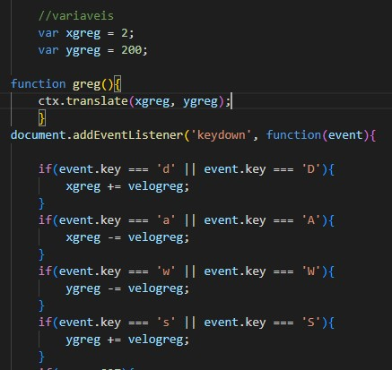
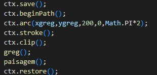

# Atividade de tranformações no canvas
# Feito por: Leonardo Macêdo e Miguel Oliveira
# Descrição
Essa é uma ativade que vamos implementar as funções: Traslação, Rotação, Escala, Trasnform, Clipping Path e Colisão no canvas JavaScript.
# Greg
 
O Greg nós fizemos utilizando: linhas, quadrados, curvas e círculos. 
## Código do Greg

https://github.com/Leo-Macedo/Transformacoes_DJW/assets/127630556/5f7c70f2-b08b-4472-9a91-a9d063683106

 

# Paisagem
A paisagem nós fizemos utilizando: curvas e círculos. Fizemos nuvens, pedras e o chão. 
 

## Código da paisagem

https://github.com/Leo-Macedo/Transformacoes_DJW/assets/127630556/43d3c0b5-d0d3-4f47-9913-5585ba46b02a

# Translação
 
### Variáveis
Define as coordenadas iniciais do personagem. 
### ctx.translate
Translada o contexto do canvas pelas coordenadas (xgreg, ygreg). Ou seja, move o ponto de origem (0,0) do sistema de coordenadas para as coordenadas especificadas.A função translate aceita dois parâmetros: tx e ty, que representam as coordenadas x e y para as quais o ponto de origem do sistema de coordenadas deve ser movido. Quando você chama context.translate(tx, ty), todos os desenhos subsequentes no contexto do canvas serão deslocados de tx pixels horizontalmente e ty pixels verticalmente. 
### Movimento pelas teclas
Dependendo da tecla pressionada (W, A, S ou D), as variáveis xgreg e ygreg são ajustadas de acordo, movendo o personagem na tela. A velocidade do movimento é controlada pela variável velogreg.
## Transform
Esse também utilizamos em rotação e escala que define a transformação do contexto para a matriz de identidade. Isso anula qualquer transformação anterior, garantindo que as próximas operações afetem o contexto de forma isolada. 
# Translação funcionando

https://github.com/Leo-Macedo/Transformacoes_DJW/assets/127630556/cae0e463-439d-4fbf-a9c7-b80cb3193c3a

 

# Rotação
 

### Variáveis
Esta variável será usada para armazenar o ângulo de rotação. 

### ctx.rotate
Este método rotaciona o sistema de coordenadas do contexto em um ângulo especificado, em torno do próprio eixo. O ângulo é fornecido em radianos, não em graus. Para converter graus em radianos, você pode usar a fórmula radianos = graus * Math.PI / 180. Se o ângulo está positivo, irá rotacionar no sentido horário, se está negatico, irá rotacionar no sentido anti-horário. 

### Movimento pelas teclas
Quando a tecla pressionada é a barra de espaço (' '), o valor de rgreg é incrementado em 10. E quando incrementa 10 o Greg rotaciona em torno do próprio eixo 10 graus no sentido horário pois está positivo. 

# Rotação funcionando

https://github.com/Leo-Macedo/Transformacoes_DJW/assets/127630556/9f3213a2-e449-43cd-bc5d-e03ad9bd043d

 

# Escala
 

### Variáveis
Uma variável chamada sgreg é declarada e inicializada com o valor 0.2. Que é o tamanho em x e y original do Greg. 

### ctx.scale
Essa função escala o contexto atual. Se você escalar um contexto, todos os desenhos futuros serão escalados. Os parâmetros utilizados são: 1=100%, 0.5=50%, 2=200%. Nesse caso Greg começa com 0.2=20% do seu tamanho. 

### Movimento pelas teclas
Se a tecla pressionada for '1', sgreg é incrementado por 0.01 e aumenta 1% seu tamanho. 
Se a tecla pressionada for '2', sgreg é decrementado por 0.01 e diminui 1% seu tamanho. 

# Escala funcionando

https://github.com/Leo-Macedo/Transformacoes_DJW/assets/127630556/028cfcac-484e-48b4-ab72-299a5c1f64cf

 

# Colisão
 
### Explicação
Na borda da direita se a posição x do Greg for maior que 897 ela será igual a 897 e ele "baterá" na borda. 
Na borda de baixo se a posição y do Greg for maior que 313 ela será igual a 313 e ele "baterá" na borda. 
Na borda de cima se a posição y do Greg for menor que -13 ela será igual a -13 e ele "baterá" na borda. 
Na borda da esquerda se a posição x do Greg for menor que -33 ela será igual a -33 e ele "baterá" na borda. 

# Colisão funcionando

https://github.com/Leo-Macedo/Transformacoes_DJW/assets/127630556/75778da4-7b72-4fcf-ad7d-cb69d527893c

 

# Clipping Path
 

### Explicação
Esse código desenha um círculo com centro nas coordenadas (xgreg, ygreg) para mover junto com o Greg e um raio de 200. Em seguida, definimos uma área de recorte com base nesse círculo, e qualquer coisa fora desse círculo não será desenhada. O ctx.save() salva o estado atual do contexto gráfico ctx. O ctx.restore() garante que o estado do contexto seja restaurado para o que era antes dessas operações, o que pode ser útil se você quiser continuar desenhando fora dessa área de recorte.  
A função Clipping Path permite que você crie uma região de recorte que define qual parte de um elemento deve ser mostrada. As partes que estão dentro da região são mostradas, enquanto as que estão fora são ocultadas.  

# Clipping Path funcionando

https://github.com/Leo-Macedo/Transformacoes_DJW/assets/127630556/b08f2ea8-426d-4019-aa3f-34daf74ffe1c

# ClearRect
 

### Explicação
Ele cria um retângulo de 1000 de largura por 500 de altura que limpa toda a tela quando alguma das teclas: 1, 2, espaço, w, a, s e d são acionadas. Isso serve para não repetir os desenhos quando movimenta-lós. 

# Diagrama de Classes
 
# Como usar o Git Bash
1. Criar um repositório 
2. Criar uma pasta e abrir com git besh 
COMANDOS:  
3. git init//inicializa o repositório 
4. git remote add origin (link do repositório) //associa o repositório ao servidor com a pasta 
5. git pull --allow-unrelated-histories (link do repositório) //recupera os arquivos do servidor e mescla com os arquivos locais que já existirem nos diretórios 
6. git checkout -b main muda a branch de master para main 
7. git add. //adiciona todos os arquivos pendentes ou git add nome do arquivo para adicionar um especifico 
8. git commit -am "comentário" //envia o commit para o repositório 
9. git push origin main //efetua o push enviando os commits aoservidor branch 
*git status // exibe as alterações pendentes 

# Código Git Bash

